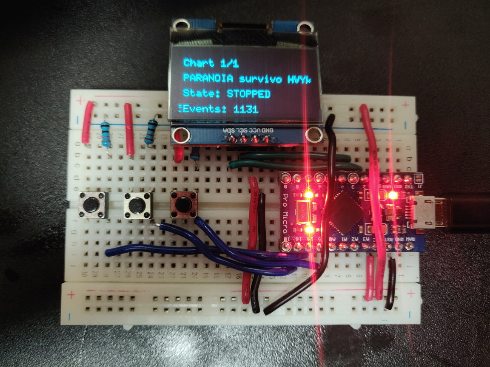
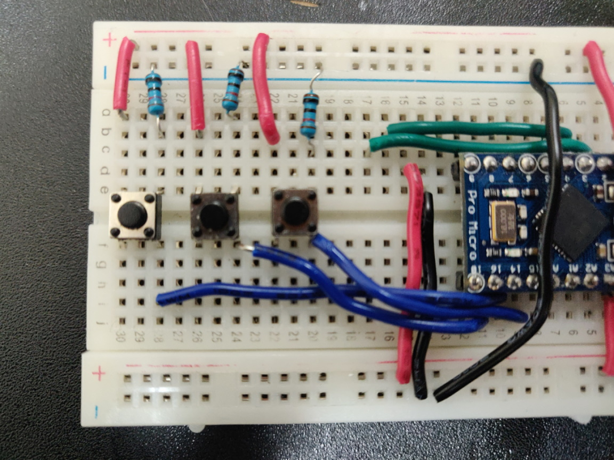

# viber
Vibes with games at specified times.

## Instructions
For chart replay mode:

1) Use `ddr2vibes.py` to convert a SSQ/CSQ chart to an intermediate JSON format.

Example: `python ddr2vibes.py --input all.csq -c single-heavy` to convert a song's heavy chart.

2) After converting all charts, use `generate_headers.py` to generate the required `viberchart_list.h` and `viberchart_meta.h` files using the data in the `charts` folder.

3) Build viber.ino and upload to Arduino.

## How to use
This Arduino program contains two modes, a chart replay mode and a metronome.

To switch between program modes, press the left button multiple times in quick succession.

### Chart Replay Mode
Use the middle and right buttons to switch between available charts.

Once you've found the chart you want to replay, hold the left button to switch playback state from `STOPPED` to `PRIMED`.

Once in `PRIMED` state, press the right button at any time to change state to `STARTED`.

To restart playback at any time while in the `STARTED` state, press and hold the right button. Release the button when you want to start playback again. You can use this to time exactly when the chart begins.

To stop playback, press the left button to change from `STARTED` to `STOPPED`.

### Metronome Mode
To decrement or increment the BPM in increments of 0.25, press (or hold) the middle and right buttons respectively.

To decrement or increment the BPM in increments of 2.50, hold the left button and press (or hold) the middle and right buttons respectively.

Hold the left button to enter `COMMAND` state.
    - While the state displays as `COMMAND`, hold the right button to change the state to `PRIMED`.
    - While the state displays as `COMMAND`, press the middle button to reset the BPM back to 120 BPM.

While the state is `PRIMED`, press the middle button to change the state to `STARTED` or hold the left button to change the state to `STOPPED`.

While the state is `STARTED`, press the left button to change the state to `STOPPED`.

## Schematic
Parts used in my build:
- 3x tactile switch buttons (any buttons will work if you can wire it)
- OLED monitor (1.3inch IIC OLED Module SKU:MC130VX)
- Arduino Pro Micro 5V/16MHz
- 3x 10k Ohm resistor

Left button goes to Arduino pin 14.
Middle button goes to Arduino pin 16.
Right button goes to Arduino pin 15.

OLED SDA goes to Arduino pin 2.
OLED SCL goes to Arduino pin 3.

(Optional) JAMMA I/O for 4 buttons goes to A0, A1, A2, A3.

